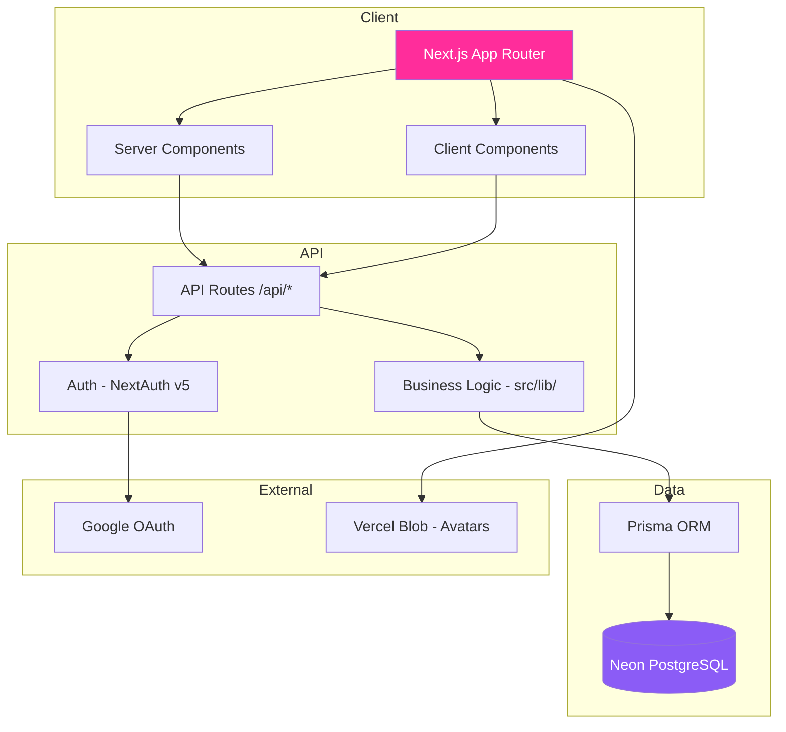
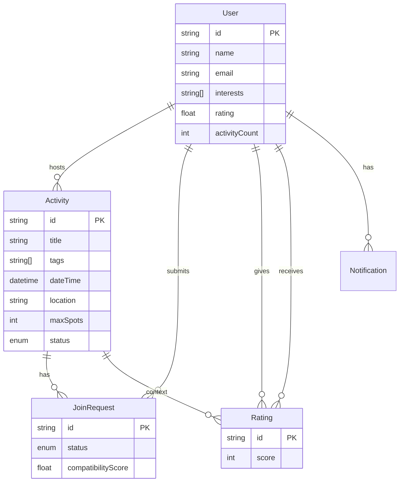

# Rally

A location-based, activity-first social platform where users post real-world activities and others request to join. Unlike Meetup or Bumble BFF, Rally focuses on spontaneous, casual meetups driven by what people want to do — not who they already know.

**Live:** [rally-app.vercel.app](https://rally-app.vercel.app) (or your Vercel URL)

## The Problem

You want to play pickup basketball Saturday morning but your usual group can't make it. You text the group chat — no response. Post an Instagram story — maybe one person replies, too late. The plan dies.

Rally fixes this by making the activity the atomic unit. Post what you want to do, let compatible strangers discover it, and decide who joins based on a compatibility score.

## Features

- **Auth** — Google OAuth + email/password via NextAuth v5
- **Activity Cards** — Create, edit, cancel activities with tags, location, date, and max spots
- **Smart Feed** — Browse nearby activities filtered by type, date, and distance
- **Join Requests** — Request to join, scored by compatibility algorithm (shared interests, proximity, rating, history)
- **Host Dashboard** — Approve/decline requests ranked by compatibility score, spots auto-update
- **Ratings** — Rate participants 1-5 stars after activities end, anonymous, updates profile average
- **Notifications** — Get notified when your request is approved or declined
- **Public Profiles** — View other users' ratings, activity stats, and interests

## Architecture





## Compatibility Scoring

The core algorithm produces a 0-100 score per join request:

| Factor           | Weight | Description                                                |
| ---------------- | ------ | ---------------------------------------------------------- |
| Shared interests | 40%    | Overlap between requester interests and activity tags      |
| Proximity        | 30%    | Haversine distance between requester and activity location |
| User rating      | 20%    | Requester's average rating from past activities            |
| Activity history | 10%    | Number of completed activities (reliability signal)        |

Edge cases: new users get a neutral default score, no tag overlap returns a minimum (not zero), self-join is rejected, full activities are blocked.

## Tech Stack

- **Framework:** Next.js 16 (App Router)
- **Language:** TypeScript (strict mode)
- **Styling:** Tailwind CSS v4
- **ORM:** Prisma 7
- **Database:** Neon (PostgreSQL)
- **Auth:** NextAuth.js v5 (JWT sessions)
- **Deployment:** Vercel
- **Testing:** Vitest (162 tests, 80%+ coverage) + Playwright (E2E)
- **CI/CD:** GitHub Actions (lint, typecheck, tests, E2E, security, AI review)

## Development

```bash
npm install
npx prisma generate
npm run dev          # Start dev server at localhost:3000

npm run test         # Run tests
npm run test:coverage # Run with coverage (70% threshold)
npm run lint         # ESLint
npm run build        # Production build
```

### Seed data

```bash
npx tsx prisma/seed.ts                # Create test users + activities
npx tsx prisma/seed-approve-test.ts   # Create test scenarios for approve/decline
```

Test accounts (password: `password123`): alex@test.com, jordan@test.com, sam@test.com, taylor@test.com, morgan@test.com, riley@test.com, casey@test.com

## Claude Code Setup

This project uses Claude Code extensively. The `.claude/` directory contains:

- **CLAUDE.md** — Project conventions, architecture, testing strategy, security guidelines
- **Skills** — `/fix-issue` (v2), `/create-pr` for standardized workflows
- **Hooks** — PreToolUse (block protected files), PostToolUse (auto-lint), Stop (quality gate)
- **Agents** — tdd-runner, code-reviewer, pr-validator, security-reviewer
- **MCP** — GitHub MCP server for issue/PR management

## Team

Built by Stevi and teammate as a pair for the Production Application project.
